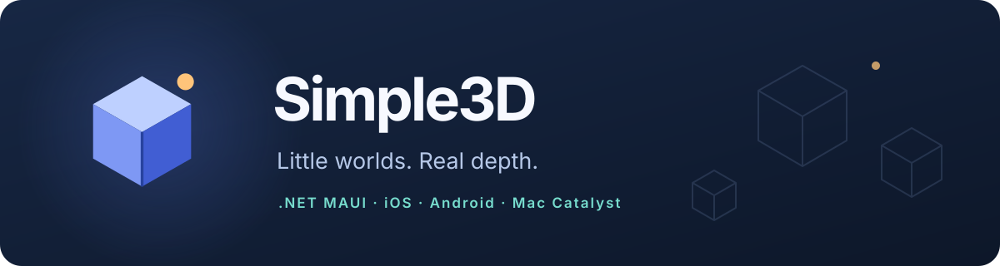
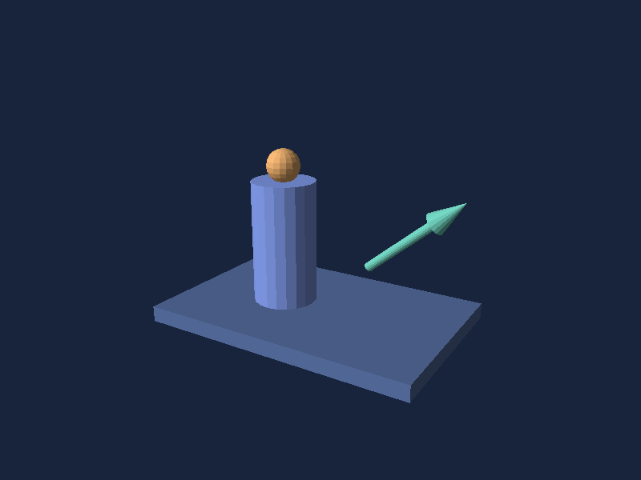

# Simple3D



Small, depth-aware 3D drawings for .NET 10 MAUI on iOS, Android, and Mac Catalyst. Describe a scene with familiar shapes or an indexed mesh, place a `SceneView` in a page, then drag to orbit, pinch to zoom, and tap to pick the visible part.



## Get started

Add references to `Simple3D.Core` and `Simple3D.Maui`, and register SkiaSharp in your MAUI host:

```csharp
using SkiaSharp.Views.Maui.Controls.Hosting;

var builder = MauiApp.CreateBuilder();
builder.UseMauiApp<App>().UseSkiaSharp();
```

Create a view:

```csharp
using Simple3D.Core;
using Simple3D.Maui;

var scene = new Scene()
    .Add(Shape.Box(0xFF8DA9FF).Named("Case").At(-.7f, 0, 0))
    .Add(Shape.Sphere(0xFFFFB775).Named("Ball").At(.7f, 0, 0));
var view = new SceneView { Scene = scene, HeightRequest = 320 };
var details = new Label();
view.Camera.FitToScene(scene, aspectRatio: 4f / 3);
view.SelectionChanged += (_, shape) => details.Text = shape?.Name ?? "Background";
Content = new VerticalStackLayout { Children = { view, details } };
```

Core colors are opaque ARGB (`0xFFRRGGBB`). Shape transforms return immutable copies and set absolute values: `Scaled(2).Scaled(3)` results in size 3. `Scene` and `Camera` changes notify the view automatically. Keep mutation and rendering on the UI thread.

## Explore the repository

For current branch status, validation evidence and continuation steps, see the [project handoff](docs/HANDOFF.md).

Development checks run locally. The hosted workflow is manually triggered from Actions when runner-specific validation is needed; ordinary commits do not schedule builds.

Open [Simple3D.sln](Simple3D.sln) in a .NET 10 MAUI-capable IDE. Select `Simple3D.Demo` as the startup project and a device or simulator. The solution includes:

- `src/Simple3D.Core`: portable indexed meshes, scenes, cameras, depth rendering, owned frames and picking.
- `src/Simple3D.Maui`: a SkiaSharp `SceneView` with bindable scene and camera, frame caching, gestures and selection.
- `samples/Simple3D.Demo`: a ten-scene interactive gallery with relevant motion in product, scientific, engineering, data and spatial illustrations.
- `samples/Simple3D.Examples`: a portable console runner that renders those scenes to PPM images.
- `tests/Simple3D.Core.Tests` and `tests/Simple3D.Maui.Tests`: executable regression runners.
- [Hostable documentation](docs/site/index.md): getting started, scene design, complex meshes, interaction, limits and XML-generated API reference.

Run portable verification and examples with:

```bash
dotnet run --project tests/Simple3D.Core.Tests -c Release
dotnet run --project tests/Simple3D.Maui.Tests -c Release
python3 -m unittest discover -s scripts -p 'test_*.py'
dotnet run --project samples/Simple3D.Examples -c Release -- --all output
```

Compare selected animation and orbit CPU costs with `dotnet run --project tests/Simple3D.Maui.Tests -c Release -- --performance`. It reports median processing times, managed allocations and Core pixel hashes for every scene. Run comparisons under similar machine load; this probe excludes native presentation and does not measure displayed FPS.

The console runner writes binary PPM images. To regenerate the PNG documentation illustrations, install Pillow and run `python3 scripts/render-doc-images.py`.

## Documentation site

Install DocFX 2.81.0 as a local tool, then generate API metadata and a static site:

```bash
dotnet tool install docfx --tool-path .tools --version 2.81.0
.tools/docfx metadata docs/site/docfx.json --warningsAsErrors
.tools/docfx build docs/site/docfx.json --warningsAsErrors
python3 -m http.server 8000 --directory _site
```

Open `http://localhost:8000`. API metadata includes both Core and MAUI and therefore needs the MAUI workload. CI builds the site and uploads the static output. Hosting only requires serving `_site` as static files; this repository does not publish it automatically.

DocFX resolves `dotnet` from your shell's `PATH` when restoring projects. If you have multiple SDK installations, put the one with MAUI workloads first in `PATH` and set `DOTNET_ROOT` to that installation before running DocFX. Selecting a different SDK only in Rider does not change DocFX's subprocesses.

## Local Mac setup

In Rider, open **Settings → Build, Execution, Deployment → Toolset and Build** and select the .NET CLI installation containing the MAUI workloads. Use its automatically detected .NET SDK MSBuild. A different installation without workloads can produce missing MAUI references throughout the editor even when the code builds from the terminal. Save this setting for the current solution.

After terminal builds with an explicit runtime identifier, run `dotnet restore samples/Simple3D.Demo` before building the whole solution in Rider. A targeted restore can replace the shared assets file and leave other platforms' runtime targets missing.

Choose the `Simple3D.Demo` configuration with the Android, iOS or macOS platform icon; the library projects are not runnable demos. Android requires the checked-in `Platforms/Android/AndroidManifest.xml`: a generated build manifest alone does not satisfy Rider's launcher.

If an iOS simulator launch hangs and ends with `HE0042` / `NSPOSIXErrorDomain code 3` (no process handle), stop the Rider run and restart only that simulator in Device Hub, then retry. This recovered the observed iPhone 17 / iOS 26.5 failure without erasing its data. The same simulator subsequently displayed the gallery from both Rider Run and Debug. The working iPhone 16e used the separate iOS 18.6 runtime.

If the default `dotnet` installation has no MAUI workloads, use the installation that has them (`dotnet workload list`), such as `$HOME/.dotnet/dotnet`:

```bash
DOTNET_ROOT="$HOME/.dotnet" "$HOME/.dotnet/dotnet" build samples/Simple3D.Demo -f net10.0-maccatalyst -c Debug
open "samples/Simple3D.Demo/bin/Debug/net10.0-maccatalyst/maccatalyst-arm64/Simple3D.Demo.app"
```

Use matching Xcode and .NET Apple workload versions. For Xcode 27, use .NET SDK 10.0.401 and workload set 10.0.401.1. The demo validates the selected Xcode version during builds. GitHub's Apple builds use the Xcode 27 runner; Android and documentation jobs remain on macOS 26. The demo targets Mac Catalyst 17 or later. The Mac Catalyst bundle uses the project assembly name so Rider's macOS run configuration finds the executable; its visible title remains Simple3D Gallery. The Mac and iOS apps register MAUI scene delegates for launch on current Apple systems.

### iOS simulator smoke check

After building the signed Debug simulator app, run `bash scripts/ios-simulator-smoke.sh` from the repository root. It selects an idle iPhone 17 Pro, iPhone 18 Pro or iPhone 17, launches three scenes and checks their screenshots. Existing booted simulator sessions are left untouched. On success, failure or interruption, it terminates the gallery and shuts down the selected simulator. A failed shutdown fails the check; an earlier failure keeps its original exit code. Screenshots remain in `artifacts` for inspection.

Use `bash scripts/ios-simulator-smoke.sh --render-probe` to check pixels, picking and retained snapshots inside the native runtime and measure Core rendering for every gallery scene. The probe is included only in Debug builds and exits before opening a gallery window. Its completion marker is required; launcher success alone does not establish that rendering worked. Results remain in `artifacts/ios-render-probe.log`.

The Apple Debug demo interprets its own assembly and compiles the rendering libraries and framework assemblies (`MtouchInterpreter=-all,Simple3D.Demo`). Changes to the rendering libraries need a rebuild. Clean and rebuild when changing interpreter settings or Apple workloads. On Xcode 27, use .NET SDK 10.0.401 with workload set 10.0.401.1 as described in the [Apple workload release instructions](https://github.com/dotnet/macios/releases/tag/dotnet-10.0.1xx-xcode27.0-10722). Interpreter configuration is documented by [Microsoft](https://learn.microsoft.com/en-us/dotnet/maui/macios/interpreter?view=net-maui-10.0).

## Scope

The software depth renderer handles intersecting opaque triangles and visible-shape picking. It has no transparency, texture mapping, shadowing, or GPU scene engine. Frames are bounded to 2,048 physical pixels per side; scenes are bounded by node, triangle, and raster sample budgets. The MAUI view lowers render resolution when an interactive view reaches the raster budget. Labels overlay geometry without depth testing. See [rendering limits](docs/site/rendering-limits.md) for exact thresholds and behavior. Profile intended scenes on target devices before using dense or animated content.

GitHub Actions runs portable checks and platform builds. Runner results and local platform checks should both be reviewed before publishing a package.
