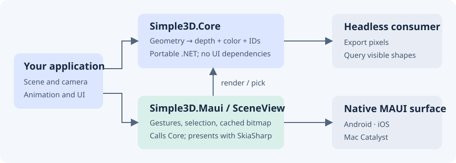
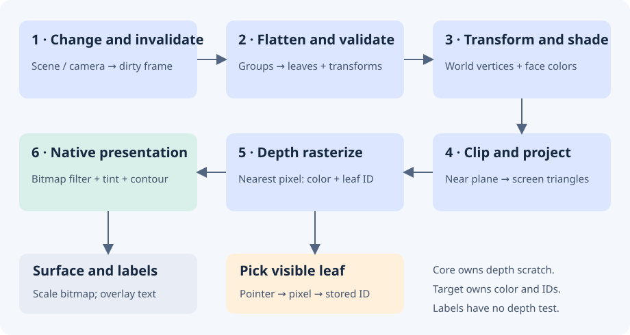

# Architecture and rendering pipeline

Simple3D is a small CPU renderer for opaque 3D diagrams inside ordinary .NET MAUI pages. You describe geometry and a camera in Core. The MAUI control renders that geometry to a bitmap, presents it through SkiaSharp, and connects pointer gestures to the camera and selection.

## Package boundaries

| Component | Responsibility | Dependencies |
| --- | --- | --- |
| `Simple3D.Core` | Shapes, immutable meshes, hierarchy, camera, projection, depth rasterization and picking | .NET 10 / System.Numerics |
| `Simple3D.Maui` | `SceneView`, gestures, caching, bitmap presentation, selection and label layout | Core, MAUI, SkiaSharp |
| Your application | Scene content, animation timing, selected-part details and layout | MAUI control, or Core alone for exports |
| Gallery | Fifteen examples using shared scene factories | Both libraries through the demo project |

Core has no MAUI or SkiaSharp dependency. You can render and query pixels in a console app without a native UI. `SceneView` uses `SKCanvasView`; SkiaSharp presents the raster image rather than executing the scene's triangles on a GPU.

This boundary keeps geometry and rendering tests portable. Your page hosts a normal MAUI view without adopting a game engine's application lifecycle.

## One frame, step by step

1. **Invalidate.** Scene and camera mutations raise synchronous notifications. The view marks cached output dirty and requests a paint. An unchanged native paint can reuse its previous target.
2. **Flatten and validate.** Core traverses groups iteratively, composes child and parent transforms, and collects geometry leaves. Repeated instances count separately. Node and triangle limits bound preparation.
3. **Transform and shade.** Each triangle moves to world coordinates. Core rejects degenerate triangles, applies optional back-face culling, and computes one color per triangle from its normal and a fixed world-space directional light. Unlit materials retain their color.
4. **Clip and project.** Points move into camera space. Core clips triangles against the near plane, then projects with perspective or orthographic math. It bounds each projected triangle to the viewport.
5. **Rasterize.** At each covered pixel center, Core compares interpolated depth with the nearest stored depth. A nearer triangle writes color and its leaf-shape ID together. Perspective uses reciprocal depth; orthographic mode uses linear depth. Equal-depth samples retain the earlier shape.
6. **Present.** The view copies changed pixels into a reusable Skia bitmap, optionally filters diagonal edges, adds selection tint and contour, and scales to the native surface. It draws labels afterward, with bounds and overlap handling.

Scratch depth storage belongs to the `DepthRenderer` instance. Color and shape-ID arrays belong to the frame or reusable target. Core projects labels separately; labels overlay geometry without depth testing.

## Picking shares visibility

A render records the winning leaf ID for each pixel. `Pick` looks up that ID and returns its shape without a second geometry pass. Hidden triangles cannot win a tap.

`SceneView.PickAt` maps layout coordinates into target pixels. Selection uses the same ID buffer, preserving occlusion without changing materials. Shape replacement transfers selection to the corresponding child position in the new tree. Keep logical child order stable during animation; removed or missing parts clear selection.

## Ownership and repeated frames

| API | Storage lifetime | Typical use |
| --- | --- | --- |
| `DepthRenderer.Render` / `SceneView.CaptureFrame` | Owned pixels and pick data survive later renders | Export, screenshot, tests |
| `DepthRenderer.RenderInto` | Fixed-size `RenderTarget` reuses color and ID arrays; the next call overwrites content | Animation and native painting |

Reuse a target at the same size and share immutable meshes between shape replacements. Core reads triangles by index, avoiding a separate triangle enumerator for each leaf. The renderer still allocates small per-frame collections for flattened nodes, shapes and labels; reuse does not mean zero allocation.

A failed `RenderInto` invalidates picking and may leave partial pixels. Render successfully before reading that target again. A renderer instance is not thread safe because it shares depth scratch storage. Mutate and render a scene on the same thread; use the UI thread with `SceneView`.

On native handler disconnect, the view releases subscriptions and rendering resources. Snapshots held by your application remain valid.

## Responsiveness and bounded work

Core caps dimensions at 2,048 pixels, traversal at 100,000 node visits, aggregate triangles at 1,000,000, and raster bounding-box samples at 16,000,000 per frame. These are resource bounds, not recommended animation workloads. See [Rendering limits](rendering-limits.md).

During pan or pinch, the view caps the longest render dimension at 512 pixels and restores configured detail after the gesture. If raster work exceeds the budget, native painting retries at half resolution and avoids probing an expensive full-size frame on every animation update. `MaximumRenderDimension` lets the application set an animation budget.

Your application owns animation timing. Replace shapes from a UI timer and stop it when the page disappears. Cost grows with covered pixels and overlap as well as triangle count. Profile the native target and distinguish CPU render time from displayed frame rate.

## Deliberate scope

The software path keeps rendering, visibility and picking in one inspectable pipeline. Its tradeoff is CPU work per covered pixel. Simple3D supports opaque triangles and fixed directional flat lighting; it has no image textures, transparency, PBR or shadows. Patterned Surface uses colored mesh cells.

`SceneRenderer` is the older projected-triangle API, retained for compatible primitive/default-camera code. `SceneView` uses `DepthRenderer`. Use the depth path for custom meshes, newer camera features and intersecting geometry.

## Read the implementation

- [Scene traversal and notifications](https://github.com/mariusmuntean/Simple3D-Maui/blob/main/src/Simple3D.Core/Scene.cs)
- [Clipping, rasterization and frame ownership](https://github.com/mariusmuntean/Simple3D-Maui/blob/main/src/Simple3D.Core/DepthRenderer.cs)
- [Native presentation, interaction and selection](https://github.com/mariusmuntean/Simple3D-Maui/blob/main/src/Simple3D.Maui/SceneView.cs)
