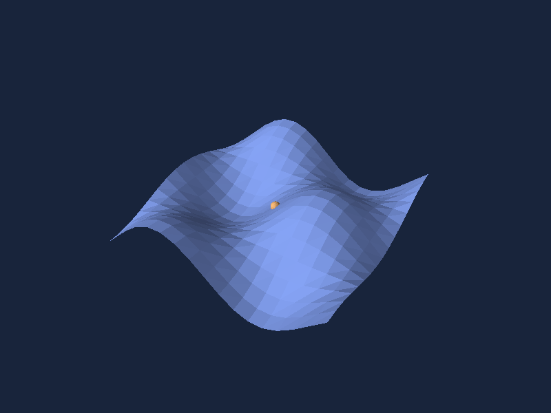

# Meshes and groups

A `Mesh` copies finite vertices and triangle indices and validates index ranges and nondegenerate faces. The same immutable mesh can be shared by many `Shape.FromMesh` instances. Material controls opaque color, fixed directional lighting, and whether back faces render.

```csharp
using System.Numerics;

var mesh = new Mesh(
    [new Vector3(-1, 0, 0), new Vector3(1, 0, 0), new Vector3(0, 1, 0)],
    [0, 1, 2]);
var face = Shape.FromMesh(mesh, new Material(0xFF86A9FF, lit: false))
    .Named("Panel");
var scene = new Scene().Add(face).Add(face.At(0, 0, -1));
```

`Shape.Group(children)` applies its transform to every child. `At`, `Rotated`, and `Scaled` set absolute local values and return a new shape. The order is local scale, local rotation, local translation, then parent transforms. A leaf name survives picking through groups. Lines and arrows are triangle meshes, so they obey the same depth and picking rules.



The [surface factory](https://github.com/mariusmuntean/Simple3D-Maui/blob/maturity-tests/samples/Simple3D.Shared/DemoScenes.cs) builds a 16 × 16 grid from shared indexed vertices. The [executable examples](examples.md) render it without MAUI, and the [demo](https://github.com/mariusmuntean/Simple3D-Maui/blob/maturity-tests/samples/Simple3D.Demo/GalleryPage.cs) adds orbit and selection.
